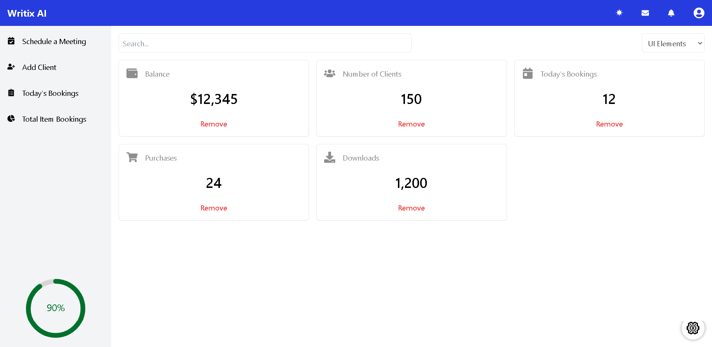
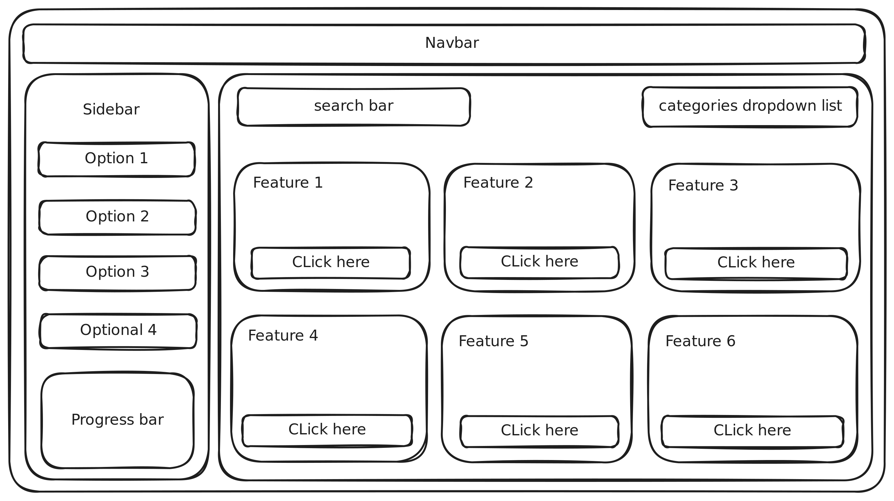

# React + Vite Project

This repository provides a minimal setup to get React working with Vite. It includes Hot Module Replacement (HMR) and ESLint rules for a smooth development experience.

## Setup Instructions

1. **Clone the Repository:**

   ```bash
   git clone https://github.com/yourusername/your-repository.git

   ```

2. **Navigate to the Project Directory:**

   ```bash
   cd your-repository

   ```

3. **Run the Development Server:**

   ```bash
       npm install

   ```

4. **Install Dependencies:**

   ```bash
   npm run dev

   ```

5. **Open Your Browser:**

   Visit http://localhost:3000 to see the application in action.

## Screenshots

### Preview



### Wireframe



## Features

- 100% Responsive for all devices
- Light and Dark Theme
- Search Bar - Functional
- Remove Btn Functional
- Data Used -> Mock Data (Every Component is Dynamic)

Feel free to contribute or suggest improvements to enhance the functionality and usability of this setup.
Copy

```

```
